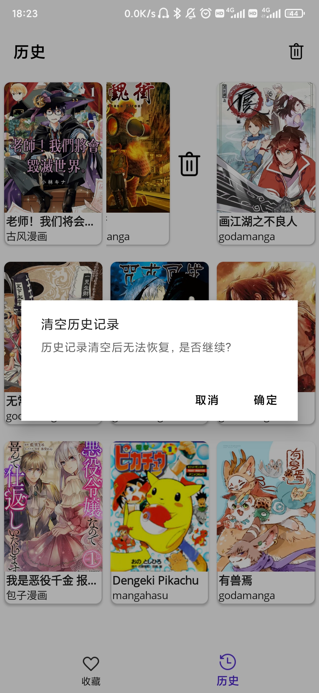

# BrilliantComic

.NET平台下MAUI跨平台框架漫画阅读器，旨在为已适配的漫画网站提供更好的阅读体验。

- 项目当前属于开发阶段，部分功能待完善...
- 主打安卓平台，可能存在异常，请谅解...

## 项目部分界面截图
### 收藏页
- 展示收藏漫画、
- 导航到搜索页、历史记录页、漫画详情页

### 历史记录页
- 展示历史观看记录
- 清空记录
- 导航到漫画详情页、收藏页

### 搜索页
- 搜索漫画
- 导航到漫画详情页

### 漫画详情页
- 收藏功能
- 漫画倒序
- 浏览器打开
- 导航到漫画浏览页

### 漫画浏览页

## 适配漫画网站

添加适配网站仅需在 **BrilliantComic.Models** 项目中添加：
- 实现 **ISource** 接口功能的图源类、
- 继承**Comic** 抽象类实现抽象方法的漫画类、
- 继承**Chapter** 抽象类的章节类、
- 在**SourceService**中注册图源和图源名。

并根据设配网站的需求略作调整即可

## 声明

项目仅用于学习交流，禁止其它任何用途。

项目使用部分图标来源：[Icons8](https://icons8.com)
项目基础：[卧龙Brilliant_see](https://gitee.com/long2023/brilliant_see?_from=gitee_search)
