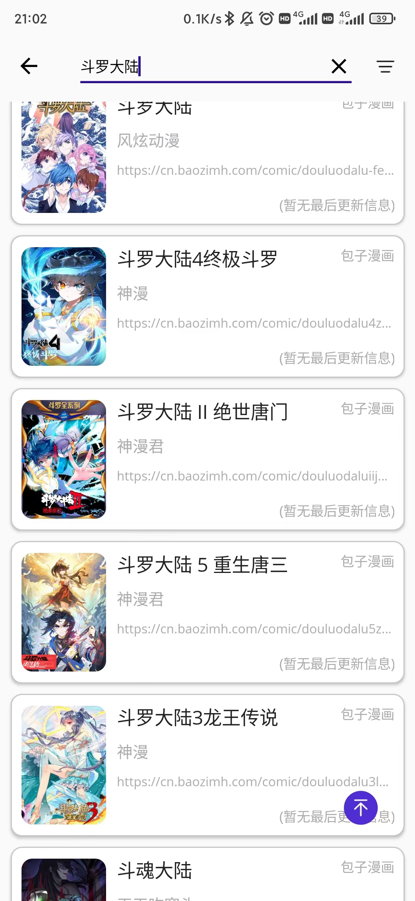
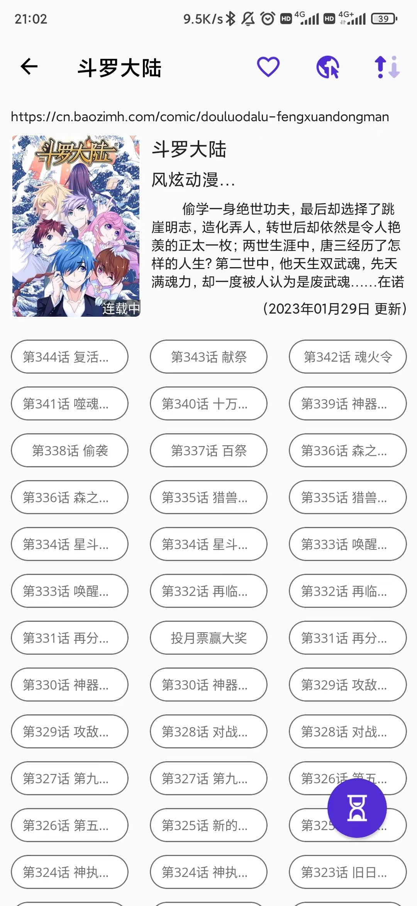

# BrilliantComic
## 项目介绍
.NET平台下MAUI跨平台框架漫画阅读器，旨在为已适配的漫画网站提供更好的阅读体验。

- 项目当前属于开发阶段，目前适配了四个图源网站（包含一个英文网站）、部分功能待完善...
- 主打安卓平台，可能存在异常，请谅解...
  
## 待解决问题
- CollectionView复用回收机制下向上翻阅卡顿，偶然闪退问题
- 部分源网站适配困难问题
- 安卓部分版本（API：24< 、>30)无法正常调整状态栏和导航栏样式
- 减少冗余重复代码，提高代码质量

## 后续发展方向：
- 适配更多图源网站以覆盖全网资源（包含国外作品）
- 拓宽领域至小说、动漫甚至影视作品
- 顺应当下潮流，开发基于semantic-kernel的AI交互助手，便利用户操作

## 项目部分界面截图
### 搜索页
- 搜索漫画、选择图源

### 漫画详情页
- 收藏、浏览器打开、漫画倒序
- 一键跳转最后浏览章节

### 收藏页
- 一键检查更新

### 历史记录页
- 清空历史记录

### 漫画浏览页

## 适配漫画网站
添加适配网站仅需在 **BrilliantComic.Models** 项目中添加：
- 实现 **ISource** 接口功能的图源类、
- 继承**Comic** 类、实现抽象方法的漫画类、
- 继承**Chapter** 类、实现抽象方法的章节类。

在 **BrilliantComic.Services** 项目中：
- 在**SourceService**中注册图源和图源名。

再根据设配网站的需求略作调整即可

## 声明

项目仅用于学习交流，禁止其它任何用途。

项目使用部分图标来源：[Icons8](https://icons8.com) 、[Iconfont](https://www.iconfont.cn)

项目基础：[卧龙Brilliant_see](https://gitee.com/long2023/brilliant_see?_from=gitee_search)
