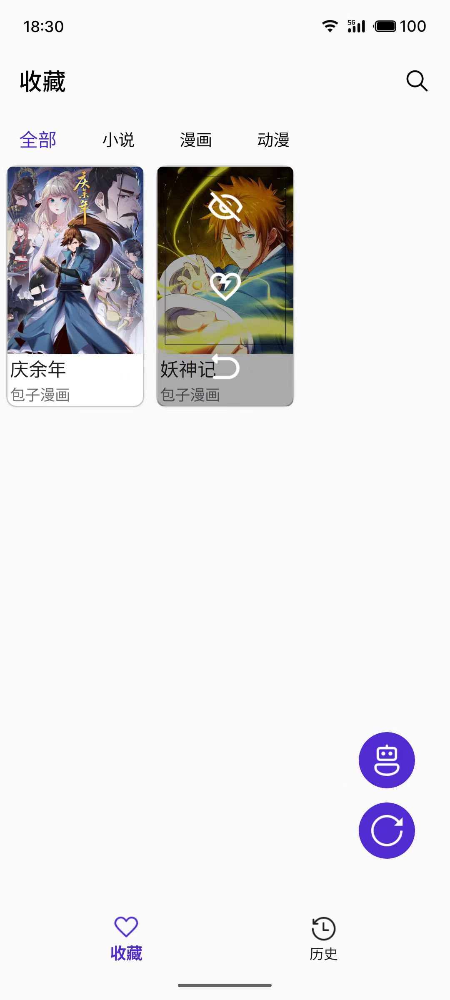
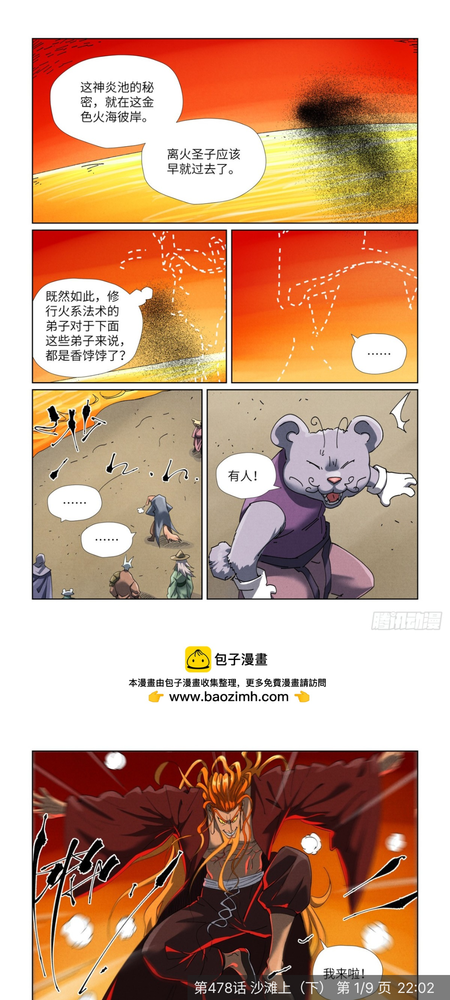
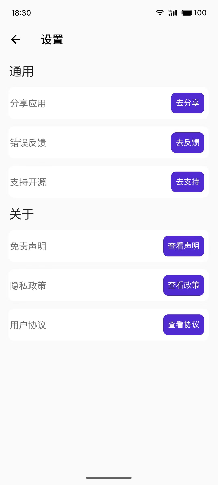

# BrilliantSee
## 项目介绍
.NET平台下MAUI跨平台框架小说，漫画，影视集成浏览软件，旨在为已适配的源网站提供更好的观看体验。

- 项目当前属于开发阶段，目前适配了四个源网站（包含一个小说源，两个漫画源，一个动漫源）、部分功能待完善...
- 主打安卓平台，可能存在异常，请谅解...

克隆仓库后若出现多处报错可尝试链接方法[Link](https://learn.microsoft.com/zh-cn/nuget/reference/errors-and-warnings/nu1105?f1url=%3FappId%3DDev17IDEF1%26l%3DZH-CN%26k%3Dk(NU1105)%26rd%3Dtrue)
  
## 待解决问题

## 后续发展方向：
- 适配更多源网站以覆盖全网资源（包含国外作品）
- 深入开发基于semantic-kernel的AI交互助手，便利用户操作

## 项目部分界面截图
### AI助手页

### 搜索页

### 详情页

### 收藏页

### 历史记录页

### 漫画页

### 视频页

### 小说页

### 设置页

## 适配源网站
添加适配网站仅需在 **BrilliantSee.Models** 项目中添加：
- 实现 **Source** 抽象功能的源类、
- 继承**Obj** 类、实现抽象方法的实体类、
- 继承**Item** 类、实现抽象方法的章节或剧集类。

在 **BrilliantSee.Services** 项目中：
- 在**SourceService**中注册源和对应实体。
- 在**DBService**初始化源设置项。

再根据设配网站的需求略作调整即可

## 声明

项目仅用于学习交流，禁止其它任何用途。

项目使用部分图标来源：[Icons8](https://icons8.com) 、[Iconfont](https://www.iconfont.cn)

项目基础：[卧龙Brilliant_see](https://gitee.com/long2023/brilliant_see?_from=gitee_search)
